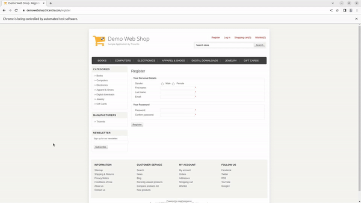

<!-- PROJECT HEADER -->
<p align="center">
  <!--PROJECT TITLE AND DESCRIPTION -->
 <h1 align="center">Automation of DemoWebShop Web Application Using Selenium, TestNG and Cucumber</h1> 

  <p align="center">
    A web automation project to automate testing process of DemoWebShop E-commerce Web Application built using Selenium and TestNG in Java.
    <br /><br/>
    <a href="https://www.linkedin.com/in/lavatech-technology-81aa6a14b/">
        </a>
    <a href="">
        </a>
  </p>
</p>
<hr>

<!-- ABOUT THE PROJECT -->

## About The Project
Automation of the [DemoWebShop E-commerce](https://demowebshop.tricentis.com/) web application using Selenium, TestNG and Cucumber focuses on validating key functionalities like register account, login, add gift card to the cart, and placing an order. Selenium is employed for interacting with the web interface, while TestNG is used to manage test execution and reporting.

* Register Account: Automation scripts to simulate a user account registration with valid credentials.
* Login Functionality: Automation scripts simulate a user logging in with valid credentials.
* Add Gift Card to Cart: The script selects a product, adds it to the cart, and validates that the cart updates correctly by verifying the product count and details.
* Place Order: The automation flow proceeds to checkout, fills in the necessary shipping and payment details, and confirms the order.



### Built With
* [Java 8](https://www.oracle.com/java/technologies/javase/javase-jdk8-downloads.html) as programming language
* [Maven](https://maven.apache.org/) for Package Management and Build Automation
* [Selenium](https://www.selenium.dev/) for Web Automation
* [TestNG](https://testng.org/) for Java testing framework that supports annotations, parallel execution, and detailed reporting for efficient test automation.
* [Cucumber](https://cucumber.io/docs/cucumber/) for writing BDD-style tests in Gherkin syntax.

<!-- GETTING STARTED -->
## Getting Started

### Prerequisites
  Basic understanding of Java with Maven, Selenium, Cucumber and TestNG.

### Running the project
Steps are listed below to get this project up and running in your development environment.

* Setup Java with JDK 1.8. For reference: Use this official [Tutorial](https://docs.oracle.com/javase/10/install/installation-jdk-and-jre-microsoft-windows-platforms.htm)

* Setup Maven. Follow this link: [Maven Setup](https://maven.apache.org/install.html)

* Clone this repository in your target folder.
```
git clone https://github.com/lavatech321/DemoWebShop_selenium_automation.git
```

* Open _demowebshop.testautomation_ folder in Eclipse by selecting "File -> Import -> Maven -> Existing Maven Project" and select _demowebshop.testautomation_ folder. 
  
Optionally, run maven build command if you don't see "Maven Dependencies" folder:

```
mvn clean install
```

You can also right click the project, and select "Maven -> Update Project -> Check the 'Force Update of Snapshots/Releases' -> Ok". This will update the "Maven Dependencies" project.

* Open _demowebshop.testautomation_ folder in Eclipse by selecting "File -> Import -> Maven -> Existing Maven Project" and select _demowebshop.testautomation_ folder. 
  
* Execute the project using below maven command:

```
mvn clean test
```

* Optionally, after making any changes to the repository, you can package the code into a jar file:
  
```
mvn clean package
```
  
_Note: I have used JAR for packaging. If you want to build into the jar file, change the `<packaging>` inside pom.xml file to war._

```
 <packaging>jar</packaging>
```

Congrats !!! You are now able to run the project in your own development environment.

* You can run this project as _TestNG Suite_ by right clicking the project and select "Run As -> TestNG Suite".

_Note: I have place *testng.xml* file under src/test/resources folder._

## Authors

*Initial work* - [Prajakta Bhargude]

